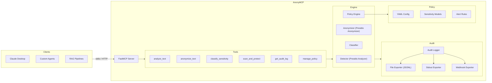

<h1 align="center">
  AnonyMCP
</h1>

<p align="center">
  <strong>Data governance as a composable MCP layer.</strong><br>
  PII detection, anonymization, classification, and audit logging for any AI workflow.
</p>

<p align="center">
  <a href="https://github.com/frankkyazze9/anonymcp/blob/main/LICENSE"></a>
  <a href="https://python.org"></a>
  <a href="https://modelcontextprotocol.io"></a>
</p>

<p align="center">
  
</p>

---
## Why This Exists

AI doesn't have a compliance layer. Not really.

Every time an LLM reads a document, processes customer data, or generates a summary, PII can leak through unnoticed. Governance today is an afterthought: bolted on at the end, enforced by policy documents nobody reads, and dependent on humans catching what machines miss. If you've spent any time in GRC, you know how that story ends.

AnonyMCP embeds governance directly into the AI workflow as a composable [MCP](https://modelcontextprotocol.io) server. Instead of asking "did we redact that?" after the fact, every piece of text becomes classifiable, auditable, and protectable *before* it ever reaches a model.

This is not just a PII scrubber. It's a policy-driven governance engine with configurable sensitivity levels, operator rules, real-time alerting, and a full audit trail. Compliance teams, legal, and engineering can finally look at the same config file and agree on what's happening.

The goal is simple: make responsible data handling the path of least resistance.

---

## Features

- **Detect** - Identify 50+ PII entity types (emails, SSNs, credit cards, names, medical records, etc.) with confidence scores
- **Anonymize** - Replace, redact, mask, hash, or encrypt PII using configurable per-entity operators
- **Classify** - Categorize text as `PUBLIC` / `INTERNAL` / `CONFIDENTIAL` / `RESTRICTED`
- **Audit** - Structured logging of every governance action with exporters (JSONL file, stdout, webhook)
- **Policy-driven** - YAML-based governance policies with per-entity operator rules and alerting thresholds
- **MCP-native** - Works with any MCP client: Claude Desktop, custom agents, RAG pipelines, or your own tooling

---

## Architecture



---

## Quick Start (Local / Dev)

### Prerequisites

- Python 3.11+
- [uv](https://docs.astral.sh/uv/) (recommended) or pip

### Install

```bash
git clone https://github.com/frankkyazze9/anonymcp.git
cd anonymcp
uv sync
uv run python -m spacy download en_core_web_lg
```

### Claude Desktop (for prototyping)

Add to your `claude_desktop_config.json`:

```json
{
  "mcpServers": {
    "anonymcp": {
      "command": "uv",
      "args": ["--directory", "/path/to/anonymcp", "run", "anonymcp"]
    }
  }
}
```

Restart Claude Desktop. You'll see 6 new tools.

---

## Enterprise Deployment

Let's be honest: production AI governance doesn't run on Claude Desktop. Here's how AnonyMCP fits into real infrastructure.

### HTTP Service (Most Common)

Run AnonyMCP as a standalone HTTP service. Your AI orchestration layer (LangChain, LlamaIndex, custom pipelines, whatever) calls it over the network like any other microservice.

```bash
# With TLS and auth (production)
ANONYMCP_TRANSPORT=streamable-http \
ANONYMCP_TLS_CERTFILE=/etc/ssl/certs/anonymcp.pem \
ANONYMCP_TLS_KEYFILE=/etc/ssl/private/anonymcp-key.pem \
ANONYMCP_REQUIRE_AUTH=true \
ANONYMCP_API_KEYS=your-secret-key \
uv run anonymcp

# Docker
cd docker && docker compose up --build
```

It's a stateless HTTP server, so horizontal scaling is straightforward. Put it behind your load balancer or service mesh and point your MCP client SDK at `https://anonymcp-service:8100/mcp`.

### Kubernetes / Helm

Deploy as a sidecar or standalone service in your cluster:

```yaml
# k8s deployment (simplified)
apiVersion: apps/v1
kind: Deployment
metadata:
  name: anonymcp
spec:
  replicas: 2
  template:
    spec:
      containers:
        - name: anonymcp
          image: anonymcp:latest
          ports:
            - containerPort: 8100
          env:
            - name: ANONYMCP_TRANSPORT
              value: "streamable-http"
            - name: ANONYMCP_POLICY_PATH
              value: "/config/policy.yaml"
          volumeMounts:
            - name: policy-config
              mountPath: /config
      volumes:
        - name: policy-config
          configMap:
            name: anonymcp-policy
```

Store your governance policy in a ConfigMap or Secret. When the policy changes, roll the deployment. Hot-swap via the `manage_policy` tool works too, but GitOps is cleaner for audit purposes.

### Python SDK Integration

If MCP feels like overkill for your use case, you can import the engine directly:

```python
from anonymcp.engine.detector import TextDetector
from anonymcp.engine.anonymizer import TextAnonymizer
from anonymcp.engine.classifier import TextClassifier
from anonymcp.policy.engine import PolicyEngine

policy_engine = PolicyEngine.from_file("policies/default.yaml")
detector = TextDetector()
anonymizer = TextAnonymizer(policy=policy_engine.policy)
classifier = TextClassifier(policy_engine=policy_engine)

# Use in your pipeline
result = detector.detect("Customer SSN is 219-09-9999")
protected = anonymizer.anonymize(result.raw_results)
```

This is useful when you're embedding governance checks inside existing Python services and don't need the MCP protocol layer.

### CI/CD Pipeline Gate

Run AnonyMCP as a pre-deployment check to scan prompts, templates, or LLM outputs before they ship:

```bash
# In your CI pipeline
echo "$PROMPT_TEMPLATE" | uv run python -c "
from anonymcp.engine.detector import TextDetector
import sys
detector = TextDetector()
result = detector.detect(sys.stdin.read())
if result.entities_found > 0:
    print(f'BLOCKED: {result.entities_found} PII entities found')
    sys.exit(1)
print('CLEAN')
"
```

---

## Security

A governance tool that sends PII in plaintext over the network is worse than useless. It's a liability. AnonyMCP ships with TLS and API key authentication built in so the defaults are secure and any gaps are the implementor's config problem, not ours.

### TLS (Transport Encryption)

Provide cert and key paths. AnonyMCP configures HTTPS automatically via uvicorn:

```bash
ANONYMCP_TRANSPORT=streamable-http \
ANONYMCP_TLS_CERTFILE=/etc/ssl/certs/anonymcp.pem \
ANONYMCP_TLS_KEYFILE=/etc/ssl/private/anonymcp-key.pem \
uv run anonymcp
```

If you bind to a network interface (`0.0.0.0`) without TLS configured, AnonyMCP logs a warning. Localhost-only deployments (`127.0.0.1`) skip the warning since the traffic never leaves the box.

### Mutual TLS (mTLS)

For zero-trust environments where you need to verify the *client* too:

```bash
ANONYMCP_TLS_CA_CERTS=/etc/ssl/certs/client-ca.pem
```

This enables client certificate verification. Only clients presenting a cert signed by your CA can connect.

### API Key Authentication

TLS encrypts the wire. Auth controls who gets in:

```bash
ANONYMCP_REQUIRE_AUTH=true
ANONYMCP_API_KEYS=pipeline-key:read,admin-key:admin
```

Every HTTP request must include `Authorization: Bearer <key>`. Keys are compared in constant time to prevent timing attacks. Missing or invalid keys get a 401/403 and a warning in the audit log.

### Role-Based Access Control

Each API key is assigned a role that controls which tools it can call:

| Role | Tools | Use Case |
|---|---|---|
| `read` | analyze_text, anonymize_text, classify_sensitivity, scan_and_protect | Pipeline agents, application integrations |
| `admin` | All tools including get_audit_log and manage_policy | Security team, CI/CD, ops tooling |

Keys without a role suffix (e.g. `my-key` instead of `my-key:read`) default to `admin` for backward compatibility. stdio transport (Claude Desktop) always runs as admin since it's a local single-user context.

### Security Model Summary

| Layer | What It Does | Config |
|---|---|---|
| TLS | Encrypts data in transit | `ANONYMCP_TLS_CERTFILE`, `ANONYMCP_TLS_KEYFILE` |
| mTLS | Verifies client identity via certs | `ANONYMCP_TLS_CA_CERTS` |
| API Keys | Application-level access control | `ANONYMCP_REQUIRE_AUTH`, `ANONYMCP_API_KEYS` |
| RBAC | Per-key role scoping (read vs admin) | Role tag in `ANONYMCP_API_KEYS` |
| Policy Engine | Controls what gets redacted and how | `ANONYMCP_POLICY_PATH` |
| Audit Log | Records every governance action | `ANONYMCP_AUDIT_ENABLED` |

stdio transport (Claude Desktop, local dev) does not need any of this because traffic never hits the network.

For the full threat model, hardening guide, and known limitations, see [SECURITY.md](SECURITY.md).

---

## MCP Tools

| Tool | Description |
|---|---|
| `analyze_text` | Detect and locate PII entities with confidence scores |
| `anonymize_text` | Anonymize PII using configurable operators (replace, redact, mask, hash, encrypt) |
| `classify_sensitivity` | Classify text as PUBLIC / INTERNAL / CONFIDENTIAL / RESTRICTED |
| `scan_and_protect` | Full detect, classify, anonymize pipeline in one call |
| `get_audit_log` | Query audit records with filters (action, classification, time range) |
| `manage_policy` | View, list entity types, or hot-swap the active governance policy |

---

## Governance Policies

Policies are YAML files that control how AnonyMCP classifies, anonymizes, and alerts. See [`policies/default.yaml`](policies/default.yaml) for the full schema.

```yaml
entity_sensitivity:
  HIGH: [US_SSN, CREDIT_CARD, IBAN_CODE, US_BANK_NUMBER]
  MEDIUM: [EMAIL_ADDRESS, PHONE_NUMBER, PERSON, US_PASSPORT]
  LOW: [URL, DATE_TIME, IP_ADDRESS]

anonymization:
  HIGH:
    operator: redact
  MEDIUM:
    operator: replace
    params:
      new_value: "[{entity_type}]"
  LOW:
    operator: mask
    params:
      masking_char: "*"
      chars_to_mask: 4
      from_end: false
```

---

## Configuration

| Variable | Default | Description |
|---|---|---|
| `ANONYMCP_TRANSPORT` | `stdio` | `stdio` or `streamable-http` |
| `ANONYMCP_POLICY_PATH` | `./policies/default.yaml` | Path to governance policy |
| `ANONYMCP_SCORE_THRESHOLD` | `0.4` | Minimum PII detection confidence |
| `ANONYMCP_AUDIT_ENABLED` | `true` | Enable audit logging |
| `ANONYMCP_HOST` | `0.0.0.0` | HTTP server bind address |
| `ANONYMCP_PORT` | `8100` | HTTP server port |
| `ANONYMCP_TLS_CERTFILE` | none | Path to TLS certificate (enables HTTPS) |
| `ANONYMCP_TLS_KEYFILE` | none | Path to TLS private key |
| `ANONYMCP_TLS_CA_CERTS` | none | CA certs for mutual TLS (client verification) |
| `ANONYMCP_REQUIRE_AUTH` | `false` | Require API key for HTTP requests |
| `ANONYMCP_API_KEYS` | none | Comma-separated valid API keys |

---

## Who Is This For?

### For Legal and Compliance Teams

Every detection, classification, and anonymization action gets logged with timestamps, entity types, classification levels, and policy versions. That's your evidence trail. Governance policies are defined in human-readable YAML, so legal can review and approve the rules without asking engineering to translate. Classification levels (PUBLIC through RESTRICTED) map directly to standard data classification frameworks you're already using for GDPR, HIPAA, and PCI-DSS.

### For CISOs and Security Leaders

AnonyMCP is a security control that sits in the data path and enforces sensitivity policies *before* data reaches LLMs or downstream systems. Alerting rules trigger on high-severity classifications or entity count thresholds and push to your existing incident response via webhooks. Fully self-hosted. No data leaves your infrastructure. The policy engine supports hot-swapping, so governance rules update without service restarts.

### For Privacy Engineers and Developers

Drop-in MCP server you can wire into any AI workflow in minutes. Wraps Microsoft Presidio (the industry-standard NLP-based PII engine) behind a clean tool interface with six composable operations. Use `scan_and_protect` for a one-call pipeline, or chain `analyze_text` then `classify_sensitivity` then `anonymize_text` for granular control. Custom recognizers, per-entity operator overrides, and YAML policy files give you full flexibility without touching core code.

---

## Development

```bash
# Install dev dependencies
uv sync --dev

# Run tests (62 tests)
uv run pytest tests/ -v

# Lint
uv run ruff check src/ tests/

# Type check
uv run mypy src/anonymcp/
```

---

## Roadmap

- [ ] Multi-language PII detection
- [ ] Image and document PII redaction (OCR pipeline)
- [ ] Structured data scanning (JSON, CSV, databases)
- [ ] Compliance preset policies (HIPAA, PCI-DSS, GDPR)
- [ ] Prometheus metrics and OpenTelemetry exporter
- [ ] Custom recognizer plugin system
- [ ] Web dashboard for audit log visualization
- [ ] Batch processing mode for large document sets

---

## Contributing

Contributions welcome. Open an issue first to discuss what you'd like to change. See [CONTRIBUTING.md](CONTRIBUTING.md) for guidelines.

## License

Apache 2.0. See [LICENSE](LICENSE).

---

<p align="center">
  Built by <a href="https://github.com/frankkyazze9">Frank Kyazze</a>
</p>